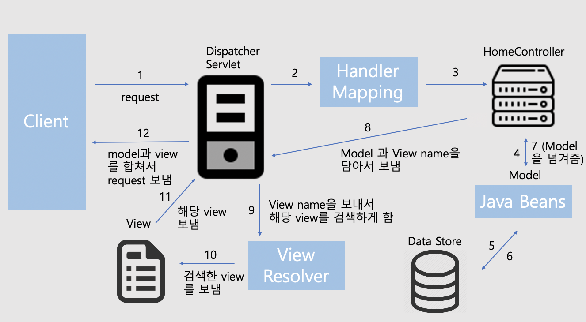
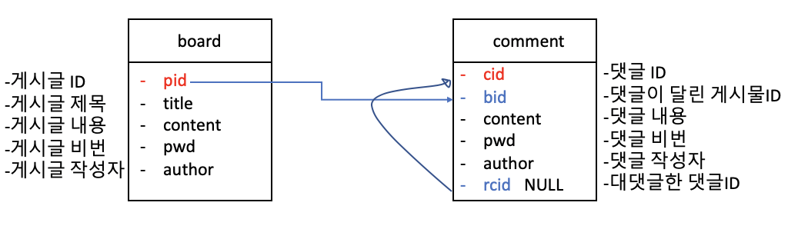
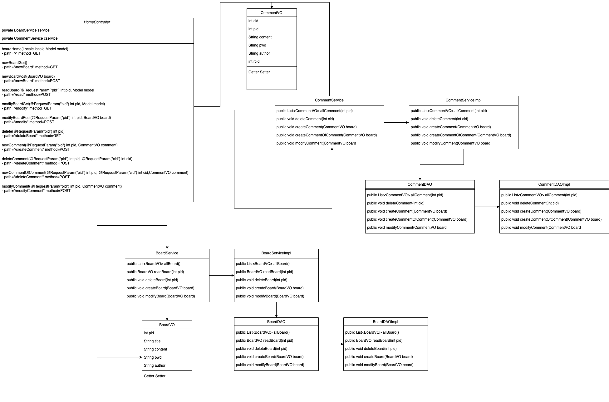

## 사용한 프레임워크

- Spring Framework 4.3.20.RELEASE
  - Spring-webmvc
  - Spring-test
  - Spring-jdbc
  - Spring-context
- mybatis 3.4.1
- mysql 8.0.18
- jstl 1.2

- pom.xml에서 dependency를 확인해주세요!

## 어플리케이션 시작 방법

1. 파일 다운로드
2. 같은 디렉토리내에 tomcat 서버 추가
3. 해당 프로젝트의 maven -> update project

**자세한 사항은 pom.xml 확인!!**

  

## Application 흐름도

- 5번 과정에서 DAO를 이용
  - Service -> DAO -> mapper 즉 mybatis 를 활용하여 db 접속 및 데이터 추출
- 6번 과정에서는 BoardVO CommentVO 가 각각 존재
  - 해당 요청에 맞는 Java Beans로 model을 생성

## DB Diagram

  

## Class Diagram

